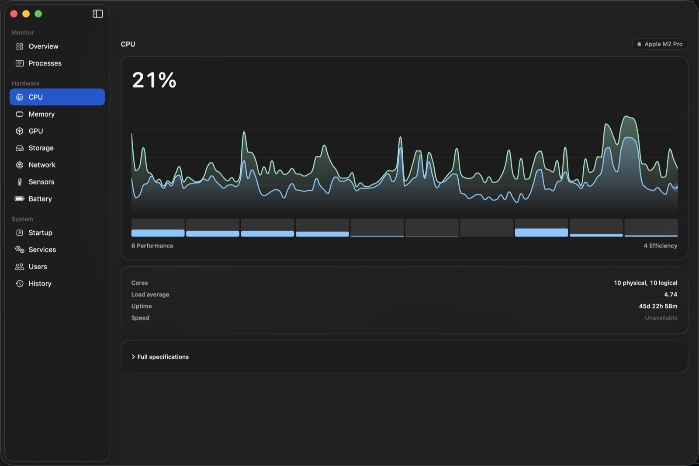
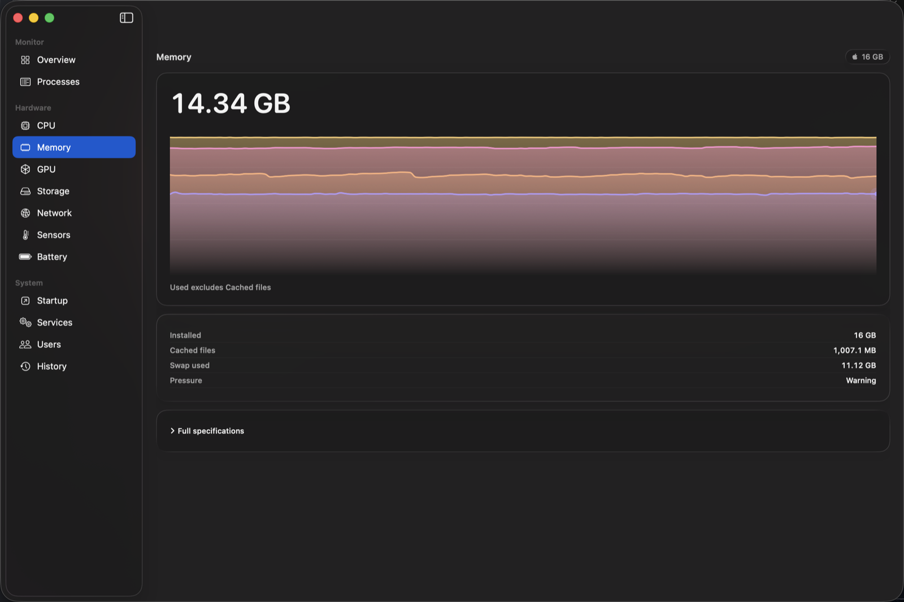
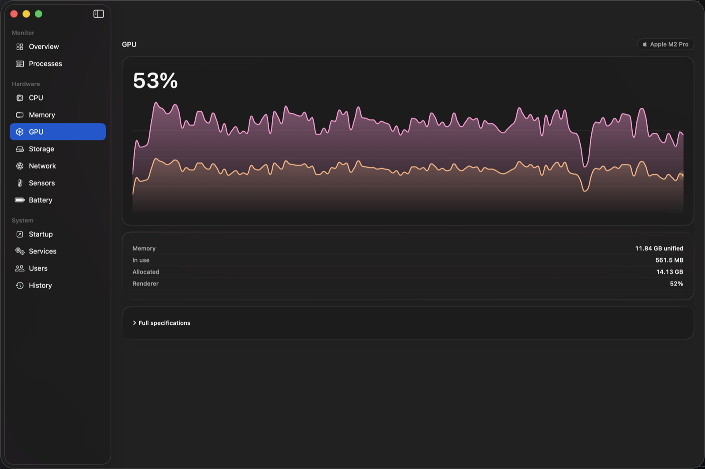
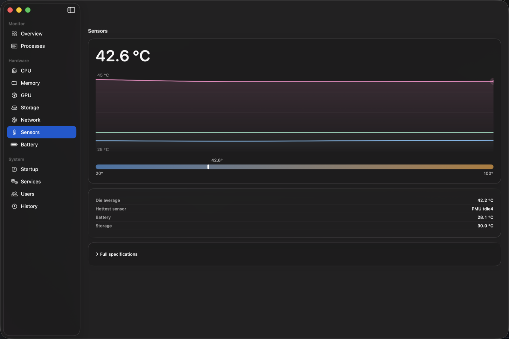
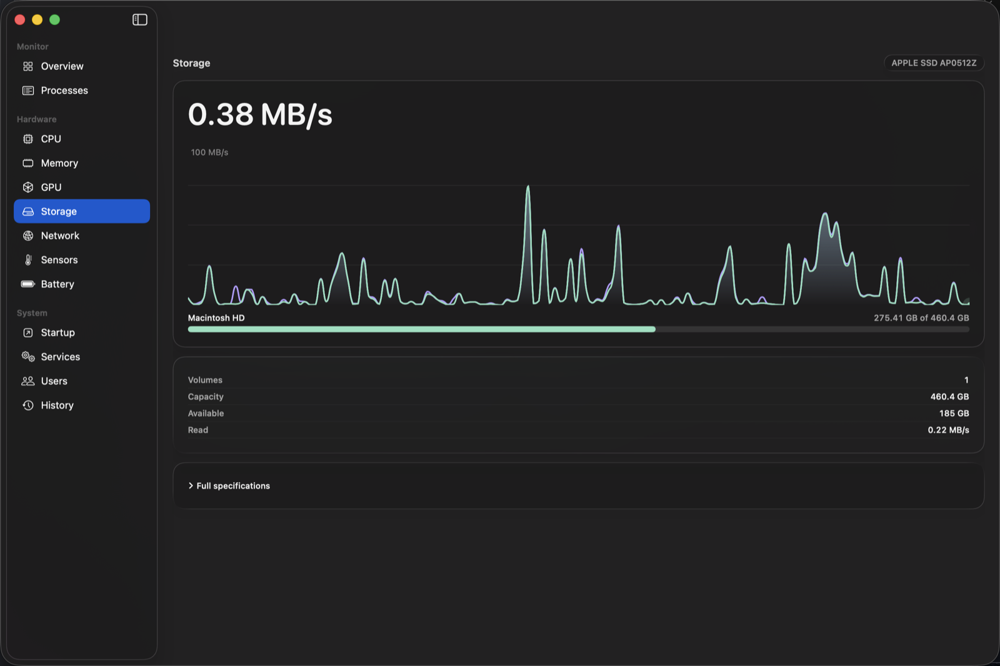
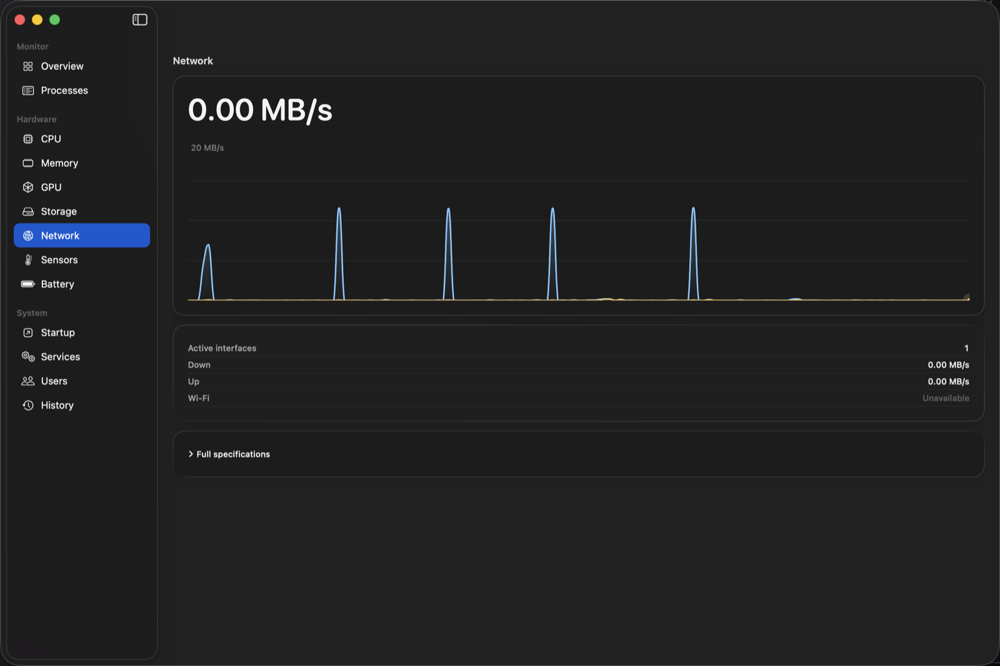
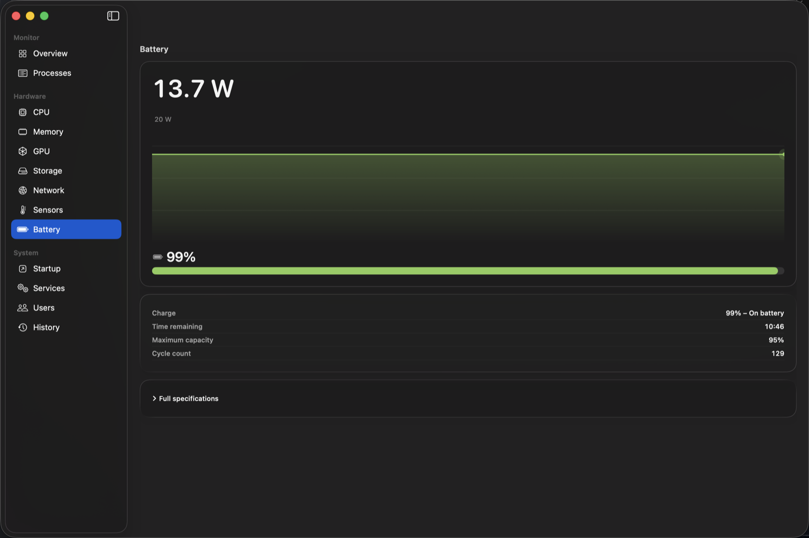

# Vitals

A macOS system monitor. Live CPU, memory, GPU, storage and network readings, with
per-subsystem detail pages. Native SwiftUI, no third-party dependencies.


## Download

Grab the latest `Vitals-<version>.zip` from
[Releases](https://github.com/DrKet/Vitals/releases), unzip, and move
`Vitals.app` to your Applications folder.

**macOS 26 or later is required.** On anything older the app will not launch.

### The first time you open it

Vitals is signed ad-hoc, not with a paid Apple Developer certificate, so
macOS will say:

> "Apple could not verify Vitals is free of malware."

That is Gatekeeper telling you the truth: this app has not been notarized by
Apple. To open it anyway, either:

- open **System Settings → Privacy & Security**, scroll to the Security
  section, and click **Open Anyway** next to the message about Vitals, then
  authenticate and confirm **Open Anyway** again in the dialog that follows
  (on current macOS, right-clicking → Open shows the same blocking dialog as
  double-clicking — there is no one-click override left, only this path); or
- run `xattr -dr com.apple.quarantine /Applications/Vitals.app`, which skips
  all of the above

You only need to do this once. If you would rather not, build from source
instead — see below for why that sidesteps the warning entirely.

## Requirements

- **macOS 26.0 or later.** This is a hard floor set in `Package.swift`, not a
  suggestion — the app builds against APIs that do not exist on earlier releases.
  On an older macOS it will not compile.
- **A Swift 6 toolchain.** Developed and tested on Swift 6.3.3, targeting
  `arm64-apple-macosx26.0`.
- An Apple Silicon or Intel Mac. Developed on Apple Silicon; the Intel paths for
  memory and GPU topology exist and are unit-tested against captured fixtures,
  but have not been run on real Intel hardware.

## Running it

The easiest way is the [Download](#download) section above. To build from
source instead:

```bash
git clone https://github.com/DrKet/Vitals.git
cd Vitals
./scripts/build-app.sh
open build/Vitals.app
```

First build takes a minute or two. This produces the same ad-hoc-signed
bundle as a Release download, but **the Gatekeeper warning above does not
apply to it.** Gatekeeper only interrogates files carrying the
`com.apple.quarantine` extended attribute, which browsers, Mail and Finder's
unarchiver attach to things they receive from the network. A binary you
compiled locally was never downloaded, so nothing ever sets that attribute —
`open build/Vitals.app` just launches it, no warning, no override needed.

To see the raw sampler output without any UI:

```bash
cd VitalsCore
swift run vitals-dump
```

And to run the tests:

```bash
cd VitalsCore
swift test
```

## What's built

| Page | State |
|---|---|
| Overview | Live tiles for every subsystem — value, proportion bar and sparkline |
| Processes | Sortable live table — CPU, memory, threads, user, PID, with heat shading and row selection |
| CPU | Per-cluster load, core grid, topology, cache, uptime |
| Memory | Wired / App / Compressed / Cached breakdown, swap, pressure |
| GPU | Renderer / Tiler utilisation, memory topology |
| Storage | Read / write throughput, volume capacity, device name |
| Network | Down / up throughput, active interfaces |
| Sensors | Per-sensor temperatures, hottest sensor, fixed-scale thermometer |
| Battery | Live power draw, charge state, health, cycle count, time remaining |

Every hardware page has a live chart with a scrubbing crosshair that reads values
back with their age, and a sticky *Full specifications* section.

## A closer look

Each hardware page leads with a live chart in its own colour — a stacked area, a
throughput trace, a floating-scale thermometer, or a power curve — over a headline
reading and a *Full specifications* drawer.

<table>
  <tr>
    <td width="50%"><br><sub><b>CPU</b> — performance and efficiency clusters as stacked areas, with a per-core grid.</sub></td>
    <td width="50%"><br><sub><b>Memory</b> — Wired / App / Compressed / Cached as a four-band stack.</sub></td>
  </tr>
  <tr>
    <td><br><sub><b>GPU</b> — renderer and tiler utilisation, with unified-memory topology.</sub></td>
    <td><br><sub><b>Sensors</b> — die temperatures on a floating scale, plus a fixed-scale thermometer.</sub></td>
  </tr>
  <tr>
    <td><br><sub><b>Storage</b> — read / write throughput and per-volume capacity.</sub></td>
    <td><br><sub><b>Network</b> — down / up throughput across active interfaces.</sub></td>
  </tr>
  <tr>
    <td><br><sub><b>Battery</b> — live power draw, a charge-coloured level bar, health and cycle count.</sub></td>
    <td></td>
  </tr>
</table>

**Not built yet:** fan speeds and per-component power (which need a separate
AppleSMC / IOReport spike), desktop widgets, the menu-bar extra, a privileged
helper for per-process GPU and SMART health, and the Startup / Services / Users /
History pages. Those sidebar entries are visible but show a placeholder.

The Processes table's row selection is in place, but its actions are not — no
context menu, no process tree, no inspector yet.

## The rule the whole thing is built around

**Never fabricate a number.**

If a value cannot be measured it is `nil`, and it renders as "Unavailable" or an
em dash — never `0`, never blank, never a plausible-looking guess. A series with
no reading is omitted from its chart rather than drawn as a flat zero band, because
a flat zero band is a measurement the machine never reported.

That sounds obvious and is surprisingly invasive. It means a sampler throws rather
than returning an empty result; a device missing from one sampling tick counts as
*no reading* rather than zero; an out-of-range driver value becomes `nil` instead
of being clamped into something believable; a reading that cannot be attributed to
the right GPU is withheld rather than labelled with the wrong device's name; and
the chart renderer clamps its own smoothing so a curve never draws above the
samples it interpolates.

If you find somewhere it *does* invent a number, that's a bug worth reporting.

## Layout

```
VitalsCore/Sources/
  SystemMetrics/   Mach, sysctl and IOKit sampling. No UI, no scheduling.
  MetricsEngine/   An actor scheduling samplers on cadences.
  VitalsUI/        SwiftUI views, charts, design tokens.
  VitalsApp/       The app executable.
  vitals-dump/     CLI for eyeballing live sampler output.
scripts/           build-app.sh, verify-app.sh and the icon renderer.
Resources/         Vitals.icns — committed, only regenerated when the artwork changes.
docs/              Design spec and implementation plans.
```

Sampling is subscription-driven: nothing is sampled unless a view is watching it,
and closing a page stops it. Charts break their line where sampling paused rather
than drawing a straight segment across the gap.

## Contributing

Read [AGENTS.md](AGENTS.md) first. It documents the conventions, the platform
gotchas, and several traps that have already cost real time here — including three
separate occasions when a class of test turned out to prove nothing.

Two that will bite you immediately:

- Warning checks need `rm -rf .build` first. An incremental build does not
  re-emit warnings for unchanged files, so a plain `swift build` reports clean
  regardless of what is there.
- `swift test --filter` matches type identifiers, not `@Suite` display names.
  `--filter MemoryPageTests` works; `--filter "Memory page"` matches zero tests
  **and still reports success**.

## Status

Early. The foundation, the five hardware pages and the Processes table are
complete and tested, but this is not a finished app — there's no menu-bar extra
or desktop widgets yet, and several sidebar entries are placeholders. Bug
reports and observations from actually running it are the most useful thing
right now, particularly anything that looks like a fabricated number.
